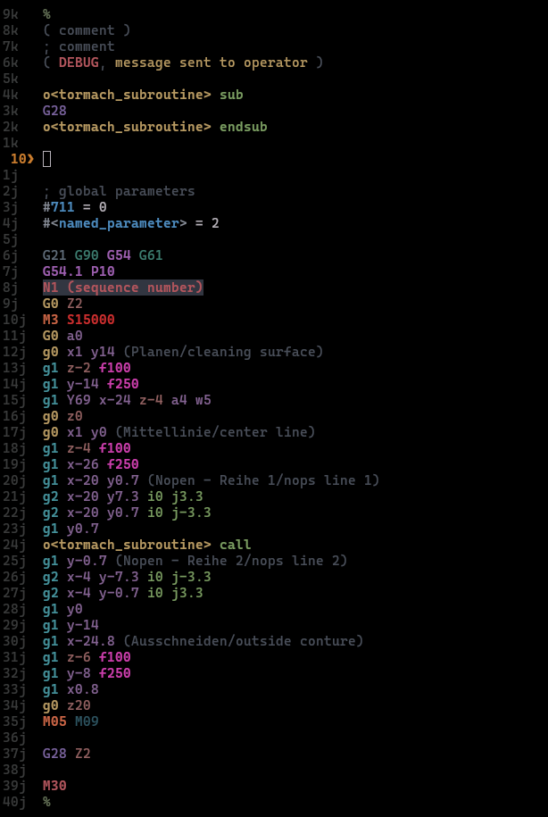

# gcode.nvim

> [!WARNING]
> This plugin was developed with AI, but is always function-tested by me before anything goes out.

Semantic G-code syntax highlighting, inline documentation, and editing tools for Neovim. Built for LinuxCNC and Tormach machines. Colors are chosen by meaning and importance — rapid traverses look different from cutting moves, coolant on looks different from coolant off, program stops are immediately obvious.



## Installation

### lazy.nvim

```lua
return {
  "fibsussy/gcode.nvim",
}
```

That's it. The plugin auto-detects G-code files and sets up keybindings automatically.

## Supported File Extensions

| Extension | Description |
|-----------|-------------|
| `.nc` | Standard G-code |
| `.ngc` | LinuxCNC G-code |
| `.gcode` | Generic G-code |
| `.gc` | G-code (simplified) |
| `.gco` | G-code output |
| `.tap` | Tape file format |
| `.ncc` | CNC G-code |

## Features

### Syntax Highlighting

G-code files are highlighted with semantic coloring by category:

#### Comments
| Pattern | Example |
|---------|---------|
| Line comments | `; This is a comment` |
| Parenthesis comments | `(comment)` or `(DEBUG,message)` |
| Program markers | `%` on its own line |

#### Subroutines (O-words)
| Pattern | Example |
|---------|---------|
| Subroutine labels | `O100`, `O<mysub>` |
| Keywords | `sub`, `endsub`, `call`, `do`, `while`, `if`, `elseif`, `else`, `endif`, `break`, `continue`, `return`, `repeat`, `endrepeat` |

#### Parameters
| Pattern | Example |
|---------|---------|
| Numbered parameters | `#1`, `#5220` |
| Named parameters | `#<tool_x>` |

#### Functions
| Pattern | Example |
|---------|---------|
| Math functions | `ABS[...]`, `SIN[...]`, `COS[...]`, `SQRT[...]`, `ATAN[...]`, `ROUND[...]`, `ACOS[...]`, `ASIN[...]`, `EXP[...]`, `LN[...]`, `TAN[...]`, `FIX[...]`, `FUP[...]`, `EXISTS[...]` |

#### Operators
| Pattern | Example |
|---------|---------|
| Comparison | `EQ`, `NE`, `LT`, `GT`, `LE`, `GE` |
| Logical | `AND`, `OR`, `XOR` |

#### Syntax Colors

Brightness and boldness scales with importance — the more dangerous or critical an operation, the more it stands out.

| Element | Style | Example |
|---------|-------|---------|
| G0 rapid traverse | Bright yellow bold | `G0`, `G00` |
| G1/G2/G3 cutting | Bright cyan bold | `G1`, `G02`, `G3` |
| G4/G9 dwell | Muted steel blue | `G4 P1` |
| G17-G21 plane/units | Dim slate | `G20`, `G21` |
| G40-G42 cutter comp | Warm amber | `G41`, `G42` |
| G43-G49 tool length | Golden yellow | `G43 H1` |
| G54-G59 WCS select | Vivid violet bold | `G54`, `G55`, `G54.1 P10` |
| G80-G89 canned cycles | Bright orange bold | `G81`, `G83` |
| G31-G38 probing | Bright yellow bold | `G31` |
| M0/M1/M2/M30 stop | Hot red bold | `M0`, `M30` |
| M3/M4/M5 spindle | Bright coral bold | `M3`, `M4`, `M5` |
| M6 tool change | Vivid orange bold | `M6` |
| M7/M8 coolant on | Neon blue bold | `M7`, `M8` |
| M9 coolant off | Dim blue | `M9` |
| Spindle speed (S) | Red bold | `S15000` |
| Feed rate (F) | Magenta bold | `F250` |
| Tooling (T, H) | Orange bold | `T2`, `H1` |
| X/Y axes | Dull purple | `X1.5`, `Y-3.2` |
| Z axis | Dull red | `Z-6.0` |
| I/J/K arc offsets | Green | `I0`, `J3.3` |
| Comments | Dim gray | `; comment`, `(comment)` |
| DEBUG comments | Keyword red bold, message yellow | `(DEBUG, message)` |
| Parameters | Cyan bold | `#1`, `#<named>` |
| Functions | Cyan | `ABS[x]`, `SIN[x]` |
| Program marker | Muted olive | `%` |

### Hover Documentation (`K`)

Press `K` on any G/M code, subroutine, function, or parameter to view detailed documentation:

```
K on "G0"     → Rapid move documentation
K on "M3"    → Spindle CW documentation
K on "O100"  → Subroutine label documentation
K on "SUB"   → Begin subroutine docs
K on "ABS"   → Absolute value function docs
K on "#1"    → Parameter #1 documentation
K on "%"     → Program marker documentation
```

### Subroutine Navigation

Jump between subroutines and matching control flow keywords:

| Key | Action |
|-----|--------|
| `gd` | Go to subroutine definition (`o<name> call` → `o<name> sub`) |
| `%` | Jump to matching keyword (`sub`/`endsub`, `if`/`endif`) |
| `[o` | Jump to previous `sub` or `endsub` |
| `]o` | Jump to next `sub` or `endsub` |

This works with:
- `sub` / `endsub`
- `if` / `endif`

### Axis Math (`:GcodeMath`)

Perform arithmetic operations on axis coordinates across your entire buffer or visual selection.

#### Commands

```vim
:GcodeMath Y+1          " Add 1 to all Y values
:GcodeMath Z*2          " Multiply all Z values by 2
:GcodeMath Y+1 Z-2.69   " Multiple operations at once
:GcodeMath A/3          " Divide all A values by 3
```

#### Visual Mode

Select lines in visual mode, then run:

```vim
:'<,'>GcodeMath X+5
```

#### Operations

| Operator | Description |
|----------|-------------|
| `+` | Addition |
| `-` | Subtraction |
| `*` | Multiplication |
| `/` | Division |
| `%` | Modulo |

#### Examples

```vim
:GcodeMath Y+69.42      " Y0.5000 → Y69.9200
:GcodeMath Z-2.5        " Z-1.0000 → Z-3.5000
:GcodeMath X*2          " X10.0000 → X20.0000
```

#### Supported Axes

Handles up to 9-axis machines: **X, Y, Z, A, B, C, U, V, W**

#### Error Handling

- Warns if specified axis not found in buffer
- Validates input format
- Checks buffer is modifiable

## G/M Code Documentation

Comprehensive documentation for:
- **G0-G154**: Motion, positioning, canned cycles, coordinate systems
- **M0-M299**: Program control, spindle, coolant, subprograms, I/O
- **Subroutines**: SUB, ENDSUB, CALL, DO, WHILE, IF, etc.
- **Functions**: ABS, SIN, COS, SQRT, ATAN, etc.
- **Operators**: EQ, NE, LT, GT, AND, OR, XOR

Documentation sourced from [LinuxCNC](https://linuxcnc.org/docs/html/gcode/) and [Tormach](https://tormach.com/machine-codes).

## Credits

- **Original Plugin**: [dlmarquis/gcode.vim](https://github.com/dlmarquis/gcode.vim) - This plugin is inspired by and builds upon the original Vimscript version
- **Documentation**: [LinuxCNC](https://linuxcnc.org/docs/html/gcode/) and [Tormach](https://tormach.com/machine-codes)

## License

GPL-3.0
